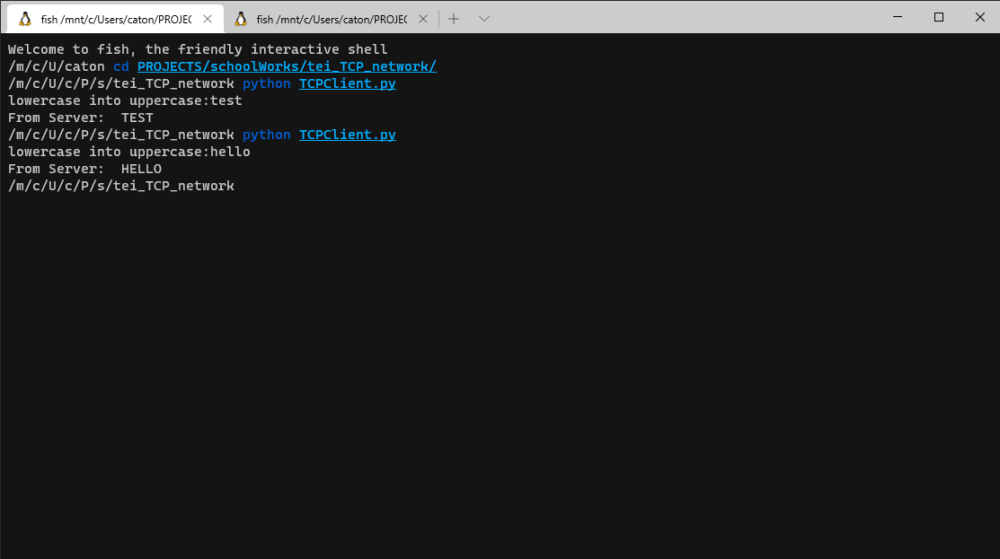
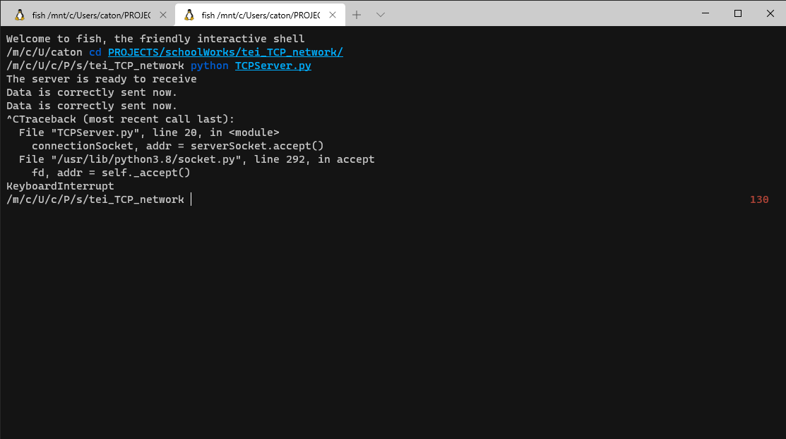

# tei_TCP_network
generic TCP connection on localhost using python

## dependancies
    python v3

## how to use
run TCPServer, then TCPClient
finally type something on client side so that u will have the result bacc

TCPClient:

TCPServer:
